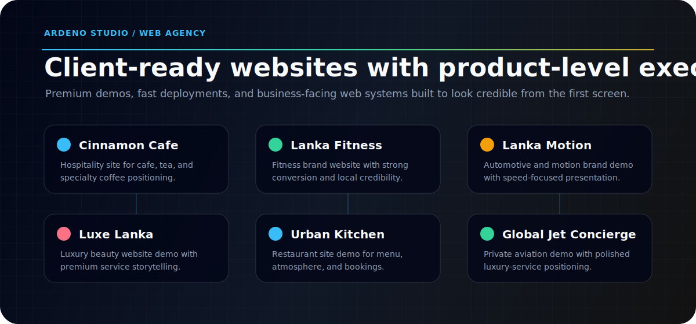
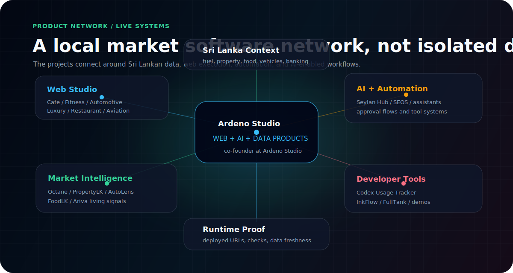
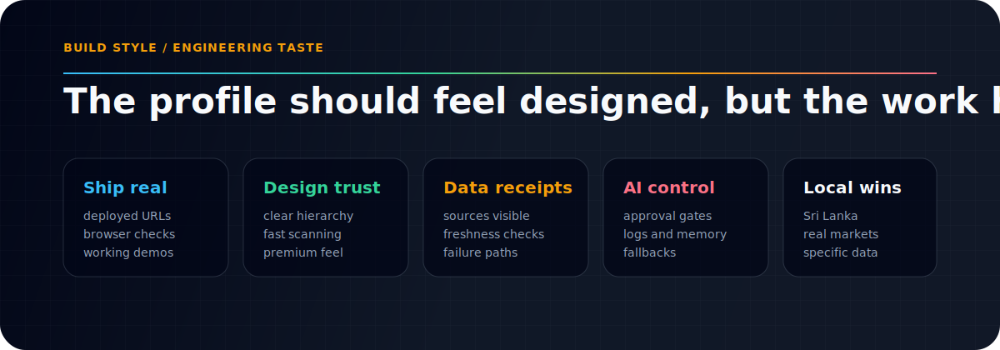

  

  
  
  
  

   
   

  

## Command Brief

I am **Suven Seoras**, an **Artificial Intelligence and Data Science** student from Colombo and **co-founder at Ardeno Studio**. I build across two connected lanes: polished client-facing websites for businesses, and deeper software systems that turn messy local data into useful products.

The goal is simple: make things that look sharp enough for clients, but are engineered enough to survive outside a demo.

<table>
  <tr>
    <td width="33%">
      <strong>01 / Web studio</strong> 
      Premium websites, landing pages, demo brands, and client-ready web experiences through Ardeno Studio.
    </td>
    <td width="33%">
      <strong>02 / Intelligence systems</strong> 
      Sri Lanka-focused products for fuel, vehicles, property, food, living costs, and business operations.
    </td>
    <td width="33%">
      <strong>03 / AI operations</strong> 
      Assistants, automations, dashboards, local tools, and workflows with logs, approvals, and fallback paths.
    </td>
  </tr>
</table>

  

  
  
  
  
  
  

## Product Constellation

  

  
  
  
  
  
  

## Selected Systems

<table>
  <tr>
    <td width="50%">
      <strong><a href="https://github.com/ArdenoStudio/octane">Octane</a></strong> 
      Fuel price intelligence for Sri Lanka with history, alerts, widgets, and an open API.
    </td>
    <td width="50%">
      <strong><a href="https://github.com/ArdenoStudio/sri-lanka-property-price-intelligence-platform">PropertyLK</a></strong> 
      Real estate intelligence with scraping, geocoding, heatmaps, trends, and deal scoring.
    </td>
  </tr>
  <tr>
    <td width="50%">
      <strong><a href="https://github.com/SuvenSeo/Vehicle-Platform">AutoLens LK</a></strong> 
      Vehicle price intelligence for Sri Lankan listings with analytics surfaces and backend APIs.
    </td>
    <td width="50%">
      <strong><a href="https://github.com/ArdenoStudio/seylan-hub">Seylan Hub</a></strong> 
      Banking buildathon system with wallets, assistant flows, loan health, and SME bookkeeping.
    </td>
  </tr>
  <tr>
    <td width="50%">
      <strong><a href="https://github.com/SuvenSeo/SEO-OS">SEOS</a></strong> 
      Personal AI operating system with memory, tools, Telegram automation, and dashboard workflows.
    </td>
    <td width="50%">
      <strong><a href="https://github.com/SuvenSeo/codex-usage-tracker">Codex Usage Tracker</a></strong> 
      Local analytics for Codex usage, token estimates, project breakdowns, and reports.
    </td>
  </tr>
</table>

## Build Principles

  

## Stack Surface

  

  
  

  

  
<strong>Open full project directory</strong>

| Project | Type | Link |
| --- | --- | --- |
| Octane | Fuel price intelligence | [repo](https://github.com/ArdenoStudio/octane) / [live](https://octane-smoky.vercel.app) |
| PropertyLK | Real estate intelligence | [repo](https://github.com/ArdenoStudio/sri-lanka-property-price-intelligence-platform) / [live](https://propertylk-one.vercel.app/) |
| AutoLens LK | Vehicle price intelligence | [repo](https://github.com/SuvenSeo/Vehicle-Platform) / [live](https://vehicle-platform-one.vercel.app/) |
| FoodLK | Food price intelligence | [repo](https://github.com/SuvenSeo/Food-Platform) / [live](https://food-platform-one.vercel.app) |
| Ariva | Living intelligence | [repo](https://github.com/ArdenoStudio/life-platform) |
| Seylan Hub | AI banking demo | [repo](https://github.com/ArdenoStudio/seylan-hub) / [live](https://seylan-hub.vercel.app/) |
| Seylan Uptime | Status monitoring | [repo](https://github.com/ArdenoStudio/seylan-uptime-monitor) |
| SEOS | Personal AI operating system | [repo](https://github.com/SuvenSeo/SEO-OS) |
| Codex Usage Tracker | Local developer analytics | [repo](https://github.com/SuvenSeo/codex-usage-tracker) |
| InkFlow Studio Demo | Creative product demo | [repo](https://github.com/SuvenSeo/InkFlow-Studio-Demo) / [live](https://inkflow-studio-demo.vercel.app) |
| FullTank | Crowdsourced fuel availability | [repo](https://github.com/OnithaPerera/FullTank) |

  
<strong>Open Ardeno Studio web demos</strong>

| Demo | Type | Live |
| --- | --- | --- |
| Cinnamon Cafe | Cafe / hospitality | [ardeno-cinnamon-cafe.vercel.app](https://ardeno-cinnamon-cafe.vercel.app) |
| Lanka Fitness | Fitness studio | [ardeno-lanka-fitness.vercel.app](https://ardeno-lanka-fitness.vercel.app) |
| Lanka Motion | Automotive / motion brand | [ardeno-lanka-motion.vercel.app](https://ardeno-lanka-motion.vercel.app) |
| Luxe Lanka | Luxury beauty brand | [ardeno-luxe-lanka.vercel.app](https://ardeno-luxe-lanka.vercel.app) |
| Urban Kitchen | Restaurant | [ardeno-urban-kitchen.vercel.app](https://ardeno-urban-kitchen.vercel.app) |
| Global Jet Concierge | Private aviation | [global-jet-concierge.vercel.app](https://global-jet-concierge.vercel.app) |
| Ardeno Studio | Agency site | [ardeno-studio-website.vercel.app](https://ardeno-studio-website.vercel.app) |
| Contact | Client intake | [ceynk.link/ardenostudio](https://ceynk.link/ardenostudio) |

## Connect

  
  
  
  

