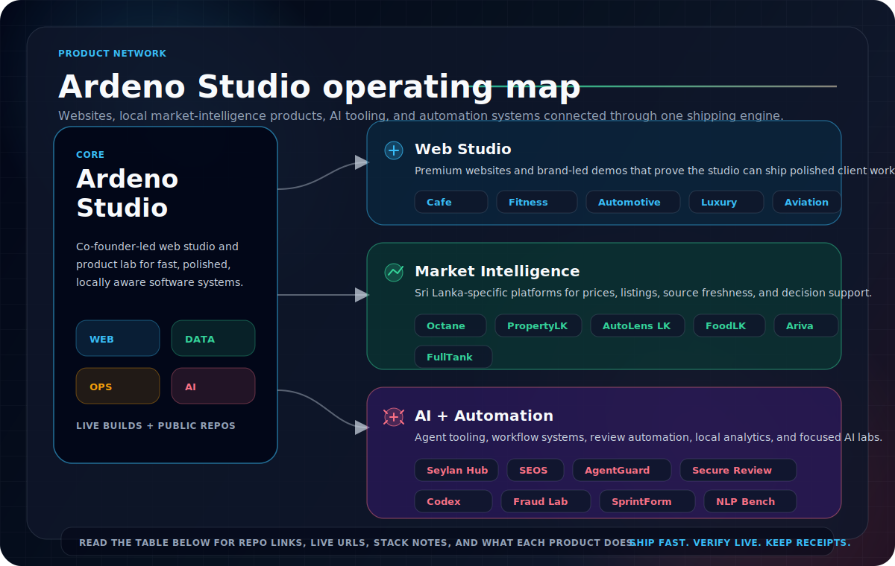

  

  
  
  
  

   
   

  

## Signal

I am **Suven Seoras**, an **Artificial Intelligence and Data Science** student from Colombo and co-founder at **Ardeno Studio**. I build across two lanes: polished client-facing websites for businesses, and deeper software systems that turn messy local data into usable products.

That mix is intentional. A good product needs taste, deployment speed, reliable data, and enough engineering discipline to survive outside a demo.

<table>
  <tr>
    <td width="33%">
      <strong>Studio lane</strong> 
      Premium websites, landing pages, brand-led demo builds, and client-ready web experiences through Ardeno Studio.
    </td>
    <td width="33%">
      <strong>Systems lane</strong> 
      Sri Lanka market intelligence platforms for fuel, vehicles, property, food, and living-cost signals.
    </td>
    <td width="33%">
      <strong>AI lane</strong> 
      AI assistants, automation workflows, local tools, dashboards, and product experiments with real guardrails.
    </td>
  </tr>
</table>

## Ardeno Studio

Ardeno Studio is the web agency and product lab where I work as co-founder. We build websites for businesses, then use the same shipping engine to create larger software products and AI-enabled platforms.

| Demo | Type | Live |
| --- | --- | --- |
| Cinnamon Cafe | Cafe / hospitality | [ardeno-cinnamon-cafe.vercel.app](https://ardeno-cinnamon-cafe.vercel.app) |
| Lanka Fitness | Fitness studio | [ardeno-lanka-fitness.vercel.app](https://ardeno-lanka-fitness.vercel.app) |
| Lanka Motion | Automotive / motion brand | [ardeno-lanka-motion.vercel.app](https://ardeno-lanka-motion.vercel.app) |
| Luxe Lanka | Luxury beauty brand | [ardeno-luxe-lanka.vercel.app](https://ardeno-luxe-lanka.vercel.app) |
| Urban Kitchen | Restaurant | [ardeno-urban-kitchen.vercel.app](https://ardeno-urban-kitchen.vercel.app) |
| Global Jet Concierge | Private aviation | [global-jet-concierge.vercel.app](https://global-jet-concierge.vercel.app) |
| Ardeno Studio | Agency site | [ardeno-studio-website.vercel.app](https://ardeno-studio-website.vercel.app) |
| Contact | Client intake | [ceynk.link/ardenostudio](https://ceynk.link/ardenostudio) |

## Product Network

  

## Selected Systems

| System | What it does | Stack / angle |
| --- | --- | --- |
| [Octane](https://github.com/ArdenoStudio/octane) | Fuel price intelligence for Sri Lanka with price history, alerts, widgets, and an open API. | FastAPI, React, PostgreSQL, Fly.io, Vercel |
| [PropertyLK](https://github.com/ArdenoStudio/sri-lanka-property-price-intelligence-platform) | Real estate intelligence with scraping, geocoding, heatmaps, trend charts, and deal scoring. | FastAPI, PostgreSQL, Playwright, React |
| [AutoLens LK](https://github.com/SuvenSeo/Vehicle-Platform) | Vehicle price intelligence for Sri Lankan listings with analytics surfaces and backend APIs. | Python, FastAPI, React, TypeScript, Supabase |
| [FoodLK](https://github.com/SuvenSeo/Food-Platform) | Food price platform for Sri Lankan market signals and source tracking. | Data ingestion, dashboards, local price intelligence |
| [Ariva](https://github.com/ArdenoStudio/life-platform) | Living-intelligence dashboard connecting food, fuel, property, and vehicle signals. | Python, market intelligence, product integration |
| [Seylan Hub](https://github.com/ArdenoStudio/seylan-hub) | Banking buildathon system with wallets, assistant flows, loan health, and SME bookkeeping. | FastAPI, Supabase, Groq, ElevenLabs, Next.js |
| [Seylan Uptime](https://github.com/ArdenoStudio/seylan-uptime-monitor) | Public uptime and status history for Seylan Hub. | Upptime, GitHub Actions |
| [SEOS](https://github.com/SuvenSeo/SEO-OS) | Personal AI operating system with memory, tools, Telegram automation, and dashboard workflows. | Next.js, Supabase, Groq, Gemini |
| [AgentGuard](https://github.com/SuvenSeo/agentguard) | Local-first security preflight for AI-agent repos, MCP configs, and developer workstations. | Python CLI, static analysis, SARIF, GitHub Actions |
| [Secure Review Action](https://github.com/SuvenSeo/secure-review-action) | Security-focused deterministic code review GitHub Action with PR comments and SARIF output. | TypeScript, GitHub Actions, Semgrep, SARIF |
| [Codex Usage Tracker](https://github.com/SuvenSeo/codex-usage-tracker) | Local analytics for Codex usage, token estimates, project breakdowns, and reports. | Python, PowerShell, HTML reports |
| [FinTech Fraud Lab](https://github.com/SuvenSeo/fintech-fraud-lab) | Synthetic real-time fraud detection lab with streaming-ready pipeline, ML scoring, and investigator dashboard. | Python, machine learning, analytics, streaming design |
| [SprintForm AI](https://github.com/SuvenSeo/sprintform-ai) | Computer-vision workstation for sprint and jump mechanics analysis. | TypeScript, video analysis, sports tech, biomechanics |
| [Lanka NLP Bench](https://github.com/SuvenSeo/lanka-nlp-bench) | Reproducible Sinhala and Tamil NLP benchmark suite with datasets, data cards, baselines, and evaluation scripts. | Python, NLP, Sinhala, Tamil, benchmark |
| [Ride Pilot](https://github.com/SuvenSeo/ride-pilot) | RidePilotLK Android app monorepo with project docs and Automata reference materials. | Kotlin, Android, Gradle, mobile app |
| [InkFlow Studio Demo](https://github.com/SuvenSeo/InkFlow-Studio-Demo) | Premium reader, writer, and admin demo for a polished creative-product workflow. | Full-stack product demo |
| [FullTank](https://github.com/OnithaPerera/FullTank) | Crowdsourced fuel availability and queue visibility for Sri Lanka. | Next.js, Supabase, maps |

## Build Style

| Principle | How it shows up |
| --- | --- |
| Ship the real thing | I prefer deployed URLs, working dashboards, smoke tests, and browser checks over vague claims. |
| Design still matters | Even technical products need clear hierarchy, fast reading, and a UI that earns trust. |
| Data needs receipts | Freshness, source visibility, failures, and update paths matter as much as charts. |
| AI needs control | Approvals, logs, suppression rules, and graceful fallbacks make automation usable. |
| Local context wins | I like building for Sri Lanka-specific problems where generic software misses the details. |

## Stack

  

  
  

## Live Board

| Product | Live |
| --- | --- |
| Octane | [octane-smoky.vercel.app](https://octane-smoky.vercel.app) |
| Seylan Hub | [seylan-hub.vercel.app](https://seylan-hub.vercel.app/) |
| PropertyLK | [propertylk-one.vercel.app](https://propertylk-one.vercel.app/) |
| AutoLens LK | [vehicle-platform-one.vercel.app](https://vehicle-platform-one.vercel.app/) |
| FoodLK | [food-platform-one.vercel.app](https://food-platform-one.vercel.app) |
| Secure Review Action | [secure-review-action.vercel.app](https://secure-review-action.vercel.app) |
| Lanka NLP Bench | [lanka-nlp-bench.vercel.app](https://lanka-nlp-bench.vercel.app) |
| InkFlow Studio Demo | [inkflow-studio-demo.vercel.app](https://inkflow-studio-demo.vercel.app) |

## Connect

| Channel | Link |
| --- | --- |
| GitHub | [@SuvenSeo](https://github.com/SuvenSeo) |
| Studio | [@ArdenoStudio](https://github.com/ArdenoStudio) |
| LinkedIn | [suvenseoras](https://www.linkedin.com/in/suvenseoras/) |
| Ardeno contact | [ceynk.link/ardenostudio](https://ceynk.link/ardenostudio) |
