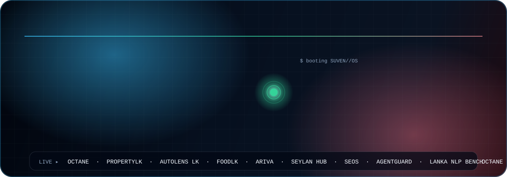

<!-- ████████  SUVEN // OS  ████████  profile README — github.com/SuvenSeo  ████████ -->

<p align="center">
  
</p>

<p align="center">
  <a href="https://www.linkedin.com/in/suvenseoras/"></a>
  <a href="https://github.com/ArdenoStudio"></a>
  <a href="https://www.ardenostudio.online/"></a>
  <a href="https://ceynk.link/ardenostudio"></a>
  
</p>

<p align="center">
  
</p>

<div align="center"></div>

## `> whoami`

```ts
const suven: Operator = {
  name:     "Suven Seoras",
  role:     "AI · Data · Product Engineer",
  studio:   "Co-founder @ Ardeno Studio",
  based:    "Colombo, Sri Lanka 🇱🇰",
  studies:  "BSc Artificial Intelligence & Data Science",
  builds:   ["premium websites", "market-intelligence platforms",
             "automation pipelines", "AI-native products"],
  thesis:   "Taste + deployment speed + reliable data + engineering" +
            " discipline = a product that survives outside the demo.",
  status:   "shipping" as const,
};
```

I work across two lanes on purpose. **Studio lane:** polished, client-facing web for real businesses. **Systems lane:** software that turns messy local data — fuel, vehicles, property, food, living costs — into products people can actually use. Plus a **personal lab** of AI assistants, automation, and security tooling, each with real guardrails.

<table>
  <tr>
    <td width="25%" valign="top"><b>🌐 Web Studio</b><br/><sub>Premium sites, brand-led builds, and client-ready experiences via Ardeno Studio.</sub></td>
    <td width="25%" valign="top"><b>📊 Data Products</b><br/><sub>Sri Lanka market-intelligence platforms with freshness, sources, and receipts.</sub></td>
    <td width="25%" valign="top"><b>⚙️ Automation</b><br/><sub>Pipelines with approvals, logs, suppression rules, and graceful fallbacks.</sub></td>
    <td width="25%" valign="top"><b>🤖 AI Systems</b><br/><sub>Personal AI OS, agents, memory, and AI-enabled product surfaces.</sub></td>
  </tr>
</table>

<div align="center"></div>

## `> featured --systems`

<table>
  <tr>
    <td width="50%" valign="top">

**🛰️ [SEOS](https://github.com/SuvenSeo/SEO-OS)** — Personal AI operating system<br/>
<sub>Memory, tools, Telegram automation, scheduled routines and dashboard workflows. The layer everything else plugs into.</sub><br/>
<sub>`Next.js` · `Supabase` · `Groq` · `Gemini`</sub>

</td>
    <td width="50%" valign="top">

**📟 [AI Coding Usage Tracker](https://github.com/SuvenSeo/ai-coding-usage-tracker)** ⭐ — Dev tool<br/>
<sub>Local-first dashboard for Codex / Claude Code / Cursor — tokens, credits, USD estimates, native GUI, WakaTime sync.</sub><br/>
<sub>`Python` · `GUI` · `analytics`</sub>

</td>
  </tr>
  <tr>
    <td width="50%" valign="top">

**⛽ [Octane](https://github.com/ArdenoStudio/octane)** — Fuel-price intelligence · [live](https://octane-smoky.vercel.app)<br/>
<sub>Sri Lanka fuel-price intelligence: price history, alerts, embeddable widgets, and an open API.</sub><br/>
<sub>`TypeScript` · `FastAPI` · `PostgreSQL`</sub>

</td>
    <td width="50%" valign="top">

**🚗 [AutoLens LK](https://github.com/SuvenSeo/Vehicle-Platform)** — Vehicle intelligence · [live](https://vehicle-platform-one.vercel.app/)<br/>
<sub>Sri Lanka vehicle-price intelligence with listing analytics and backend APIs.</sub><br/>
<sub>`Python` · `FastAPI` · `React` · `Supabase`</sub>

</td>
  </tr>
  <tr>
    <td width="50%" valign="top">

**🏦 [Seylan Hub](https://github.com/ArdenoStudio/seylan-hub)** — AI banking · [live](https://seylan-hub.vercel.app/)<br/>
<sub>AI banking demo: diaspora wallets, voice assistant, loan health, SME bookkeeping.</sub><br/>
<sub>`Next.js` · `Supabase` · `Groq` · `ElevenLabs`</sub>

</td>
    <td width="50%" valign="top">

**🛡️ [AgentGuard](https://github.com/SuvenSeo/agentguard)** — AI-repo security<br/>
<sub>Local-first security preflight for AI-agent repos, MCP configs, and developer workstations.</sub><br/>
<sub>`Python` · `static analysis` · `SARIF` · `Actions`</sub>

</td>
  </tr>
</table>

<details>
<summary><b>📦 Full systems index</b> — everything, by domain <i>(click to expand)</i></summary>

<br/>

**📊 Market & living-cost intelligence**

| System | Owner | What it does | Live |
| --- | --- | --- | --- |
| [Octane](https://github.com/ArdenoStudio/octane) | Ardeno | Fuel-price intelligence: history, alerts, widgets, open API. | [↗](https://octane-smoky.vercel.app) |
| [PropertyLK](https://github.com/ArdenoStudio/sri-lanka-property-price-intelligence-platform) | Ardeno | Real-estate intel: scraping, geocoding, heatmaps, deal scoring. | [↗](https://propertylk-one.vercel.app/) |
| [AutoLens LK](https://github.com/SuvenSeo/Vehicle-Platform) | Suven | Vehicle-price intelligence + listing analytics. | [↗](https://vehicle-platform-one.vercel.app/) |
| [FoodLK](https://github.com/SuvenSeo/Food-Platform) | Suven | Food-price platform for market signals + source tracking. | [↗](https://food-platform-one.vercel.app) |
| [Ariva](https://github.com/SuvenSeo/life-platform) | Suven | Living-intelligence dashboard linking food, fuel, property, vehicles. | [↗](https://life-platform.vercel.app) |
| [CeylonGrid](https://github.com/ArdenoStudio/ceylongrid) | Ardeno | National intelligence dashboard — live map, news wire, economic pulse. | — |
| [Lanka Platform](https://github.com/SuvenSeo/lanka-platform) | Suven | Sri Lanka open-data platform — Vercel-native federated portal. | [↗](https://lanka-platform-sand.vercel.app) |

**🤖 AI, automation & agents**

| System | Owner | What it does | Live |
| --- | --- | --- | --- |
| [SEOS](https://github.com/SuvenSeo/SEO-OS) | Suven | Personal AI OS: memory, tools, Telegram automation, routines. | — |
| [Ceyfi](https://github.com/ArdenoStudio/Ceyfi) | Ardeno | AI-powered financial clarity for Sri Lankans worldwide. | [↗](https://frontend-taupe-three-96.vercel.app) |
| [Ardeno Lead Engine](https://github.com/SuvenSeo/ardeno-lead-engine) | Suven | Compliance-first lead scoring + outreach approval workflow. | [↗](https://ardeno-lead-engine.vercel.app) |

**🛡️ Security & developer tooling**

| System | Owner | What it does | Live |
| --- | --- | --- | --- |
| [AI Coding Usage Tracker](https://github.com/SuvenSeo/ai-coding-usage-tracker) ⭐ | Suven | Local usage dashboard for Codex / Claude Code / Cursor + WakaTime sync. | — |
| [AgentGuard](https://github.com/SuvenSeo/agentguard) | Suven | Security preflight for AI-agent repos, MCP configs, workstations. | — |
| [Secure Review Action](https://github.com/SuvenSeo/secure-review-action) | Suven | Deterministic security code-review Action with PR comments + SARIF. | [↗](https://secure-review-action.vercel.app) |

**🔬 Research & data labs**

| System | Owner | What it does | Live |
| --- | --- | --- | --- |
| [Lanka NLP Bench](https://github.com/SuvenSeo/lanka-nlp-bench) | Suven | Reproducible Sinhala & Tamil NLP benchmark suite + baselines. | [↗](https://lanka-nlp-bench.vercel.app) |
| [FinTech Fraud Lab](https://github.com/SuvenSeo/fintech-fraud-lab) | Suven | Synthetic real-time fraud detection: streaming pipeline + ML scoring. | — |
| [SprintForm AI](https://github.com/SuvenSeo/sprintform-ai) | Suven | Computer-vision workstation for sprint & jump mechanics. | — |

**🏛️ Civic & gov · 📱 mobile · 🎨 web demos**

| Project | Owner | What it does | Live |
| --- | --- | --- | --- |
| [GovCompanion](https://github.com/SuvenSeo/GovCompanion) | Suven | Citizen companion for Sri Lankan government services. | [↗](https://govcompanion-lk.vercel.app) |
| [GovNavigator LK](https://github.com/SuvenSeo/gov-navigator-lk) | Suven | Navigation for Sri Lankan government services. | — |
| [Ride Pilot](https://github.com/SuvenSeo/ride-pilot) | Suven | RidePilotLK Android app monorepo + Automata reference. | — |
| [ClearScan](https://github.com/SuvenSeo/ClearScan) | Suven | Android scanning app (Kotlin). | — |
| [InkFlow Studio Demo](https://github.com/SuvenSeo/InkFlow-Studio-Demo) | Suven | Premium reader / writer / admin product demo. | [↗](https://inkflow-studio-demo.vercel.app) |
| [Expense Tracker](https://github.com/SuvenSeo/expense-tracker) | Suven | React + Vite expense tracker with dashboard summaries. | — |
| [Fitfinity Demo](https://github.com/SuvenSeo/Fitfinity-Fitness-Gym-Demo) | Suven | Responsive fitness-studio demo site. | — |

**🏢 Ardeno Studio — flagship products & SaaS**

| Product | What it does | Live |
| --- | --- | --- |
| [Dinaya](https://github.com/ArdenoStudio/dinaya) | Booking SaaS for Sri Lankan SMBs. | [↗](https://dinaya-lk.vercel.app) |
| [CeylonGrid](https://github.com/ArdenoStudio/ceylongrid) | National intelligence dashboard. | — |
| [Seylan Hub](https://github.com/ArdenoStudio/seylan-hub) | AI banking demo (diaspora wallets, voice, loans). | [↗](https://seylan-hub.vercel.app/) |
| [Ceyfi](https://github.com/ArdenoStudio/Ceyfi) | AI financial clarity for Sri Lankans worldwide. | [↗](https://frontend-taupe-three-96.vercel.app) |

**🎬 Ardeno Studio — premium client websites** <sub>(live demos)</sub>

| Site | Type | Live |
| --- | --- | --- |
| Urban Kitchen | Restaurant | [↗](https://ardeno-urban-kitchen.vercel.app) |
| Luxe Lanka | Luxury beauty | [↗](https://ardeno-luxe-lanka.vercel.app) |
| Global Jet Concierge | Private aviation | [↗](https://global-jet-concierge.vercel.app) |
| Serendib Trading | Trading / corporate | [↗](https://serendib-trading.vercel.app) |
| Ceylon Stories | Gallery café | [↗](https://ceylon-stories-gallery-cafe.vercel.app) |
| Cinnamon Cafe | Café / hospitality | [↗](https://ardeno-cinnamon-cafe.vercel.app) |
| Lanka Fitness | Fitness studio | [↗](https://ardeno-lanka-fitness.vercel.app) |
| Lanka Motion | Automotive / motion | [↗](https://ardeno-lanka-motion.vercel.app) |

</details>

<div align="center"></div>

## `> tech --stack`

<p align="center"><sub><b>LANGUAGES</b></sub></p>
<p align="center"></p>

<p align="center"><sub><b>WEB · FRAMEWORKS</b></sub></p>
<p align="center"></p>

<p align="center"><sub><b>DATA · INFRA · AI</b></sub></p>
<p align="center"></p>

<div align="center"></div>

## `> git log --graph`

<picture>
  <source media="(prefers-color-scheme: dark)" srcset="https://raw.githubusercontent.com/SuvenSeo/SuvenSeo/output/github-snake-dark.svg" />
  <source media="(prefers-color-scheme: light)" srcset="https://raw.githubusercontent.com/SuvenSeo/SuvenSeo/output/github-snake.svg" />
  
</picture>

<div align="center"></div>

## `> stats --live`

<p align="center">
  
  
</p>

<p align="center">
  
  
</p>

<p align="center">
  
</p>

<p align="center">
  
</p>

<div align="center"></div>

## `> connect`

<p align="center">
  <a href="https://www.linkedin.com/in/suvenseoras/"></a>
  <a href="https://github.com/ArdenoStudio"></a>
  <a href="https://www.ardenostudio.online/"></a>
  <a href="https://ceynk.link/ardenostudio"></a>
</p>

<p align="center">
  <sub><i>「 Ship the real thing. Design still matters. Data needs receipts. AI needs control. Local context wins. 」</i></sub>
</p>

<p align="center">
  <sub>⌁ built and maintained from Colombo · <code>SUVEN//OS</code> is always shipping ⌁</sub>
</p>
